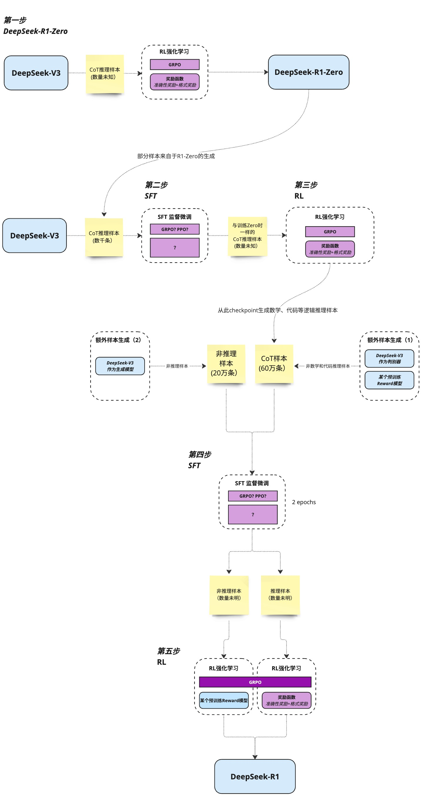

## [Incentivizing Reasoning Capability in LLMs via Reinforcement Learnining](https://wwnu.lanzouu.com/iXOZi2vh68rc)

## [2024大模型落地实例](https://wwnu.lanzouu.com/iYpsn2vh6aqd)

(点击题目可下载)

基于v3大模型的强化学习自然而然产生的r1模型的推理能力

### 1. 本文贡献了一种后训练方法,诞生了两个成果

#### 在V3基础上进行的大规模强化学习

1. 在==v3大模型基础上==直接采用强化学习，而没有用==SFT监督微调==（没有人工标注监督），但是诞生了可以解决复杂问题的思维链，r1-zero模型展现了很多自我验证，反射，以及产生长思维链

   重点是，==大模型推理能力，可以纯粹用rl来激励，不需要sft的协助==

​	如何去训练r1模型，后面介绍一种pipeline

2. 小模型可以通过==模型蒸馏==，蒸馏r1的内容，Qwen-7b llama3的推理能力可以超越参数比他们大的模型,变得更强

​	除此以外,泛化到普通任务上,有很强的性能,例如写作,问题回答上,在较为复杂的问题理解能力性能大大超过了v3

### 2. 实现方法

#### 2.1之前的工作：

用了大量有标注的数据，或者监督的数据sft，来训练推理能力,而r1只用了强化学习rl就得到了推理能力

#### 2.2 v3作为基座模型

v3质量很好，作为基座模型训练很良好,在此基础上用纯粹的强化学习来进行训练

##### 2.2.1 PRO RL算法

==GRPO，主要算法==，不同于ppo算法，不需要价值函数模型actor- critic模型或者value model减少了训练硬件要求，只用一个就可以，采取与平均值之间的距离的方式来判断

给出一个用户与语言助手对话的样本模板,prompt是参数,一个具体问题,后面回答是需要微调的部分

##### 2.2.2  奖励模型

奖励模型来决定优化方向,包括两个部分,验证准确度奖励和格式奖励

##### 2.2.3 zero的表现情况,自我进化过程,ahamemonet

r1训练随着次数,他的连贯性和通过率渐渐超过chatgpt-o1

随着rl强化学习,"自然而然的出现了一种推理能力"

推理链,随着推理次数越来越长,出现了很多自我涌现的行为,包括反思,或者重新再评估

出现了aha-moment
为了解决这个数学问题,在思考过程中,ai出现了突变的思考,单纯的运行了很多次,一直反馈,后出现了这句话
本质上是概率训练,有几率输出了wait,后面接着wait,然后出现了这些,但是为什么会出现这种话语?训练语料中的思维逻辑关系?
可以泛化到其他领域吗

##### zero缺点

zero语序胡乱,难以让人理解,较为分散,可能中文英文夹杂

#### 2.3 r1模型的冷启动

利用少量高质量数据,作为冷启动可以提高推理性能和加速收敛?

如何训练一个推理能力强,且泛化通用能力强的r1?

设计了一个4步骤pipeline

##### 2.3.1 冷启动

r1的训练过程前期,用了少量的cot链,作为微调模型,甚至包括直接从zero模型中获得这些样本(数千条)

样本应该可读性提高,发现迭代训练是推理模型的更好的方法

##### 2.3.2 针对推理的强化学习

在微调后,用与之前训练zero时一样的rl训练,来训练r1

##### 2.3.3 sft 监督微调和拒绝抽样

感觉模型快收敛时

利用得到的checkpoint作为sft数据

来用于下一轮的训练,与冷启动过程不同的是,这个阶段主要基于推理能力,且这个阶段合并了其他领域数据,用来增强编写等通用任务的能力

有推理数据(拓展了样本数据集,用v3评判模型,和一个reward模型来训练)和非推理数据(v3生成)

##### 2.3.4 训练适用于所有场景的强化学习

#### 2.4蒸馏 提升小模型推理能力

对比了蒸馏和小模型强化学习,蒸馏结果更好

非成功的尝试,比如说,用prm 过程奖励函数,蒙特卡洛树搜索,效果不好,效率不高,空间无限的,不一定不行,题目认为不成功

总结限制未来工作

